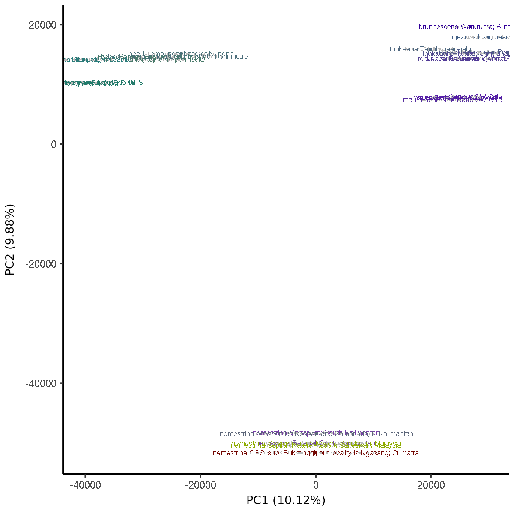

# VAPE

**Visualizing population structures and substructures using Admixture, PCA, and EEMS (VAPE)**

----

## Overview
1. [Introduction](#introduction)
2. [Getting started: Installing VAPE](#getting-started-installing-and-configuring-vape)
3. [What does my input data have to look like?](#what-does-my-input-data-have-to-look-like)
4. [Configuring VAPE to fit your data](config)
5. [What output options do I have?](#output-options)
6. [Executing VAPE workflow](#execute-vape)

----

## Introduction

The VAPE workflow brings together a number visualization tools commonly used in population structure analyses. Not only does it allow you to easily and reliably generate of a number of different plots and graphs for a sample population, but enables you to subdivide geo-referenced data into subsets linked to geography. This way you can visualize and compare substructures in your sample using different methods side by side.

The main focus lies on the following methods:
- [EEMS](http://github.com/dipetkov/eems)
- [flashpca](https://github.com/gabraham/flashpca)
- [admixture](https://www.genetics.ucla.edu/software/admixture/)

Others include:
- [pong](https://pypi.python.org/pypi/pong) visualization of admixture
- [TESS3](https://github.com/cayek/TESS3/)
- [treemix](https://bitbucket.org/nygcresearch/treemix/wiki/Home)
- [Spacemix](https://github.com/gbradburd/SpaceMix)
- [conStruct](https://github.com/gbradburd/conStruct)
- FST using [plink](https://www.cog-genomics.org/plink/1.9/)


The pipeline is implemented using [Snakemake](https://bitbucket.org/snakemake),
using `python` for most data wrangling and `R` for most plotting. You can use VAPE without prior knowledge of Snakemake by following this README step by step.


### Examples of possible outputs
For a complete list of options, please refer to [output options](output-options).

#### Two dimentsional PCA plot with names of individuals


----

## Getting started: Installing and configuring VAPE


### Requirements

In order to use VAPE, you need the following software installed:

- [anacoda/miniconda](https://conda.io/docs/user-guide/install/index.html)
- [plink](https://www.cog-genomics.org/plink2) (version 1.90)
- [flashpca](https://github.com/gabraham/flashpca)

### Clone VAPE into working directory

Create a working directory you would like to run VAPE in and clone VAPE form the github repository.

```
git clone https://github.com/NovembreLab/eems-around-the-world.git path/to/workdir
cd path/to/workdir
```

### Create a conda environment

The file `vape_environment.yaml` in  is used by conda to create an isolated environment with all the
dependencies you will need to run VAPE. This might take some minutes (environment size is about 1.3GB in size). Note: the environment name is arbitrary.

```
conda env create --name vape --file vape_environment.yaml
```

To activate this new VAPE environment:

```
source activate vape
```

To deactivate the VAPE environment later on:
```
source deactivate
```

### Edit config files
See: [Configuring the workflow to fit your data](config)

### Execute VAPE
See: [Execute VAPE workflow](#execute-vape)

----

## What does my input data have to look like?

For your input you need three types of data:
1. [Genotypes](#genotypes)
2. [Meta data for individuals and populations in your sample](#meta-data)
3. [Maps (optional)](#maps)

### Genotypes

Genotypes must be provided in binary [plink](https://www.cog-genomics.org/plink2) format, which is comprised of the following three file types:

1. *filename.bed* (Do not confuse this with the UCSC Genome Browser's BED format, which is completely different.)

2. *filename.bim*

3. *filename.fam*


### Meta data

The meta data - holding information on individuals and populations in your sample - must be provided in an adaption of the  [PopGenStructures](https://docs.google.com/document/d/1wPlI1hLr19JIdM2EzYKlPnzzbR6L2ZOgOGkC6kbhHE4/edit) format as follows:

1. *filename.indiv_meta*:
> `sampleId,source,used,originalId,permissions,popId`

2. *filename.pop_meta*
> `popId,name,abbrev,color,colorAlt,order,latitude,longitude,accuracy`


### Maps
As a default, the VAPE workflow uses maps from [Natural Earth](http://www.naturalearthdata.com/) to allow you to subset data sets into regional subsets by using words like 'Asia' or 'India'. This implementation is configured to these maps specifically, which is why they are included as files in this package. You can find them under `subsetter/maps`.

It is, however, possible to load your own maps into the workflow, if you require a more detailed resolution. Maps must then be provided in the [shapefile](https://en.wikipedia.org/wiki/Shapefile) format.

## Output options

coming soon ...

## Execute VAPE

coming soon ...
